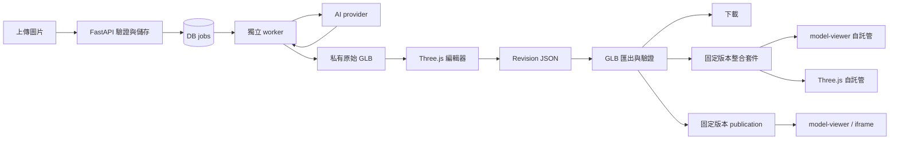

# Picture to Model — 技術架構草案

更新日期：2026-10-05。Phase 1 已建立可執行的本機流程，依賴鎖定於 `uv.lock` 與 `web/package-lock.json`；本文件其餘編輯、匯出、發布等設計仍為後續階段規劃。

目前實作：React＋Three.js 預覽、FastAPI、SQLite migration、私有本機儲存、獨立 worker 與固定 fixture provider。API 的 `/api/health` 顯示 `provider: fake`，不載入 `.env`、不呼叫任何付費 API。啟動方式與驗證範圍見 [README](../README.md)。

## 1. 技術選型

| 層 | 建議 | 理由／限制 |
| --- | --- | --- |
| 編輯前端 | React + TypeScript + Vite | 獨立 SPA，適合屬性面板與編輯狀態 |
| 3D 預覽／編輯 | Phase 1 使用 Three.js；編輯階段再評估 React Three Fiber + Drei | 目前提供預覽控制；後續加入選取、變換、材質與 GLTFExporter |
| 公開檢視 | model-viewer | 輕量展示介面，與完整編輯器分開載入 |
| API | Python + FastAPI + Pydantic | 檔案驗證、任務協調、供應商整合 |
| 本機持久層 | SQLite + 私有檔案目錄 | 先單機；禁止以 web/public 作私有資產目錄 |
| 任務執行 | 獨立 Python worker + DB jobs | 工作不依附 HTTP 請求；MVP 一個 worker |
| 正式部署 | PostgreSQL + S3 相容私有儲存 | 公開前的遷移點；有併發需求時再評估專用 queue |
| AI | Meshy 或 Tripo，一個正式 adapter | Phase 0 擇一，避免先做雙供應商完整產品 |
| 優化（後續） | glTF Transform；必要時 Blender | 一般演算法，不呼叫 AI；由 worker 啟動受限 subprocess |

Meshy 與 Tripo 均有圖片生成模型及任務 API，但品質、價格、權利條款與可用版本要以實測及當時帳戶方案確認，不能僅以 API 存在推論品質。Tripo 官方目前可查到不同 API 世代，PoC 應選定一套端點與版本，不混用欄位。Phase 0 完成後鎖定依賴與 provider model version。

## 2. 資料流



前端只呼叫本系統 API；worker 在 API 請求外提交／查詢任務。MVP 使用輪詢，不先引入 WebSocket 或 webhook。資料庫是狀態來源，不用程序記憶體當任務持久層。

## 3. 資料模型

| Entity | 關鍵欄位 |
| --- | --- |
| Project | id, owner_id, name, source_asset_id, active_revision_id, deleted_at |
| Asset | id, project_id, kind, storage_key, sha256, mime, bytes, created_at |
| Generation | id, project_id, provider, provider_model, parameters, provider_task_id, state, estimated_cost, actual_cost, error_code |
| Job | id, kind, resource_id, stage, attempt, next_run_at, lease_expires_at, idempotency_key |
| ModelVersion | id, generation_id, original_asset_id, canonical_asset_id, node_manifest, metrics |
| Revision | id, model_version_id, parent_id, schema_version, edits_json, viewer_json, created_at |
| Export | id, revision_id, settings_hash, exporter_version, status, asset_id |
| IntegrationBundle | id, export_id, target, template_version, config_schema_version, status, asset_id |
| Publication | id, project_id, revision_id, export_id, public_id, viewer_snapshot, status |

Asset、Generation、Revision、Export、IntegrationBundle 的操作都透過 Project 做 owner 檢查。本機模式的 owner 為固定 local owner，不因此把未驗證 API 暴露到公網。

原始 GLB 不可變。匯入時建立 canonical GLB 和 node/material manifest，以固定索引路徑或持久化 extras ID 辨識節點，不使用每次載入新生成的 Three.js UUID。新生成或減面結果都是新的 ModelVersion，不將舊 node ID 盲目套上去。

Revision 的 edits 包含 root transform、hidden node IDs、material overrides；viewer 設定另存相機 target／orbit、光照、背景及 autoRotate。相機環境與模型資料分離，避免宣稱 GLB 可重現整個網站場景。

## 4. 生成狀態與恢復

```text
queued → submitting → generating → downloading → validating → ready
任一階段 → failed
submitting → submission_unknown → 對帳後 generating 或人工確認 failed
generating → timed_out → 以原 provider_task_id 對帳
```

- 建立任務使用 owner + idempotency key 唯一約束；送供應商前持久化請求指紋與提交狀態。
- 有 provider idempotency／查單能力則使用；若供應商已接受但回應遺失且無法查單，不自動重送。不承諾跨第三方的 exactly-once。
- worker claim 使用 DB transaction 與 lease；重新啟動可接手 lease 過期的 job，但 submitting 任務先對帳。
- 輪詢採退避與抖動，遵守 Retry-After。下載可重試最多三次；供應商生成失敗的「重新生成」是新任務，需清楚顯示可能再次計费。
- 本機逾時只代表停止主動等待，不代表供應商停止或不收費；保存 task ID 供再次查詢。
- 原始檔寫 temporary path，完成下載及檢查後原子替換。模型 ready 必須代表本地資產已可用。

## 5. API 草案

所有私有端點正式部署時需 session 驗證；error 格式統一為 `{code, message, retryable, request_id}`。長任務回傳 202 + 內部 task ID。

| Method / Path | 用途 |
| --- | --- |
| POST /api/projects | 建立專案 |
| GET /api/projects | 擁有者列表，支援分頁 |
| GET /api/projects/{id} | 專案、生成與目前版本 |
| POST /api/projects/{id}/images | multipart 上傳與驗證 |
| POST /api/projects/{id}/generations | Idempotency-Key + source asset ID + generation options |
| GET /api/generations/{id} | 階段、進度、錯誤及結果 model version |
| GET /api/model-versions/{id} | 模型 manifest、metrics、私有資產端點 |
| POST /api/model-versions/{id}/revisions | base_revision_id + schema_version + edits + viewer |
| GET /api/revisions/{id} | 還原編輯狀態 |
| POST /api/revisions/{id}/exports | 指定格式 GLB、建立待完成匯出 |
| PUT /api/exports/{id}/content | 上傳該 revision 的前端匯出結果，後端驗證後 ready |
| GET /api/exports/{id} | 狀態及受保護下載端點 |
| POST /api/exports/{id}/bundles | 已驗證 GLB + target（model_viewer／threejs），建立套件任務 |
| GET /api/bundles/{id} | 套件狀態、限制說明與受保護 ZIP 下載端點 |
| POST /api/projects/{id}/publications | 已驗證 export ID + viewer snapshot |
| DELETE /api/publications/{id} | 撤回發布 |
| DELETE /api/projects/{id} | 撤回發布並排程刪除 |
| GET /embed/{public_id} | 公開展示頁 |
| GET /publications/{public_id}/model.glb | 驗證 publication active 後輸出模型 |

Revision 使用樂觀鎖：active revision 已與 base_revision_id 不同時回 409，避免多分頁互蓋。對同一 revision、settings hash 與 exporter version 可重用已驗證 export。

## 6. 編輯與匯出一致性

建立唯一的 `applyRevision(canonicalScene, revision)` 邏輯，預覽與匯出共用，避免兩套變換計算。匯出以 canonical scene clone 套用固定 revision，更新 world matrix 後再交給 GLTFExporter，並複製被修改的共享材質，避免污染原始場景。

MVP 匯出由瀏覽器執行，可在不增加 server 渲染工具鏈的情況下驗證一致性。關閉分頁可能中斷本次匯出，可重新開啟同 revision 重試；發布必須等後端完成 GLB 格式、尺寸、外部 URI 與資產歸屬檢查。後端不把任意上傳資料當成可信的 scene。

MVP 支援靜態 mesh、標準 glTF PBR 材質及自包含貼圖。非支援擴充、skinned mesh、動畫或超限模型在匯入時清楚拒絕，不靜默破壞。匯出後用獨立 loader 及 glTF Validator 驗證；先不做 mesh 合併，以免破壞部件編輯映射。

若後續需要無瀏覽器的批次匯出，再將 revision materialization 遷至 server pipeline，先用相同 fixture 驗證，再替換實作。

## 7. 三種整合方式與資產策略

iframe 使用 Publication；model-viewer 與 Three.js 下載套件使用 IntegrationBundle，不建立 Publication。三者引用同一個已驗證 Export，打包不得重新生成或改寫模型。Bundle 由 worker 以受控模板組裝，狀態為 queued → building → ready／failed；相同 export、target 與 template version 可重用結果，重試只重新打包。

### A. iframe

```html
<iframe
  src="https://YOUR_HOST/embed/PUBLIC_ID"
  title="商品 3D 模型"
  width="100%"
  height="480"
  loading="lazy"
  style="border:0"
></iframe>
```

`YOUR_HOST` 與 `PUBLIC_ID` 是未部署前的占位符。iframe 使用獨立頁面且不帶 editor cookie；正式部署以安全 response headers 配合所需嵌入來源。站外直接取得 GLB 的 CORS 與 iframe frame-ancestors 分開設定。

私有資產不開 public bucket。公開模型端點每次檢查 publication，MVP 不以永久物件儲存直連替代檢查。匯出下載與自行託管屬於可複製內容，不承諾 DRM。

### B／C. 自託管下載套件

共同內容為 `model.glb`、`viewer.config.json`、`poster.webp`、必要且可再散布的環境素材、README 和第三方授權聲明。model-viewer 套件增加 `index.html` 與設定載入程式；Three.js 套件增加 `src/`、`package.json`、lockfile 及建置設定。全部模型路徑相對於套件，依賴版本由受版控模板鎖定，README 列出 CDN／套件安裝所需網路。

`viewer.config.json` 包含 schemaVersion、revisionId、modelPath、posterPath、alt、camera（target、公尺距離、弧度角）、background、autoRotate、lighting／shadow 偏好。透過兩套 adapter 將共用設定映射到各 viewer；記錄支援與降級欄位，不直接共用兩個引擎的內部數值。GLB 中的 transform 不在 viewer 再套一次。

模型與 poster 取自固定 revision 的展示快照；相機、光照與背景同樣取自該 revision，變更設定需建立新 revision。若有無法重現的環境素材或陰影行為，套件產生結果回傳 warnings，下載面板及 README 顯示具體降級內容。

套件模板只接受經驗證的設定 JSON；使用固定檔名、HTML escaping 與安全 JSON 序列化，避免名稱／alt 被當成程式碼或 ZIP 路徑。不得打包 API key、session、私有資產網址或生成供應商網址。

驗證時對三種交付比對 GLB hash，並在獨立 HTTP origin 執行兩個套件；停止本系統後確認不再依賴其 API。額外測試 resize、模型載入失敗、設定欄位映射及 Three.js 點選接點。Three.js 範例僅提供開發接點，客製化互動不納入 MVP 交付。

## 8. 目錄安排

目前 `backend/app/` 採較小的模組：main、db、storage、images、providers、worker 與 migrations；`web/src/` 包含工作台、API client、ModelViewer 與樣式。先保持 Phase 1 結構簡單，下列依功能拆分的子目錄隨後續規模增加再建立。

```text
backend/app/{api,models,providers,jobs,storage,services}/
backend/tests/
web/src/{pages,editor,viewer,api}/
web/integration-templates/{model-viewer,threejs}/
web/tests/
scripts/                       # 後續模型處理與開發工具
fixtures/                      # 可合法提交的小型測試素材
docs/
pyproject.toml                 # Python dependency 與工具設定
web/package.json
```

本次保留既有 `.env` 與 `.env.example`；實作時才按選型更新必要欄位。`BLENDER_BIN` 為後續功能預留，MVP 不要求安裝 Blender。

## 9. 官方技術依據

查閱日期：2026-09-20。以下支持能力判斷，不代表價格或供應商服務保證；實作前再次核對選定版本。

- [Meshy Image to 3D API](https://docs.meshy.ai/en/api/image-to-3d)：圖片生成與任務介面。
- [Tripo Image to Model](https://developers.tripo3d.ai/en/docs/generation-image-to-model/standard) 與 [Quick Start](https://developers.tripo3d.ai/en/docs/quick-start)：生成與非同步查詢。
- [Three.js GLTFExporter](https://threejs.org/docs/pages/GLTFExporter.html)：glTF／GLB 匯出。
- [Three.js 文件](https://threejs.org/docs/)：場景、控制器與 loader。
- [model-viewer](https://modelviewer.dev/) 與 [材質／場景範例](https://modelviewer.dev/examples/scenegraph/)：網站展示與場景操作。
- [glTF Transform CLI 原始文件](https://github.com/donmccurdy/glTF-Transform/blob/main/packages/docs/src/lib/pages/cli.md)：貼圖與幾何優化。
- [Blender Decimate 文件](https://docs.blender.org/manual/en/latest/modeling/modifiers/generate/decimate.html)：一般網格減面方法，僅後續選項。
